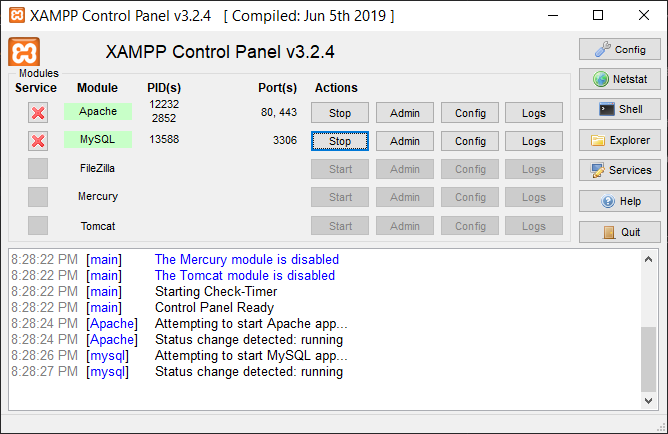
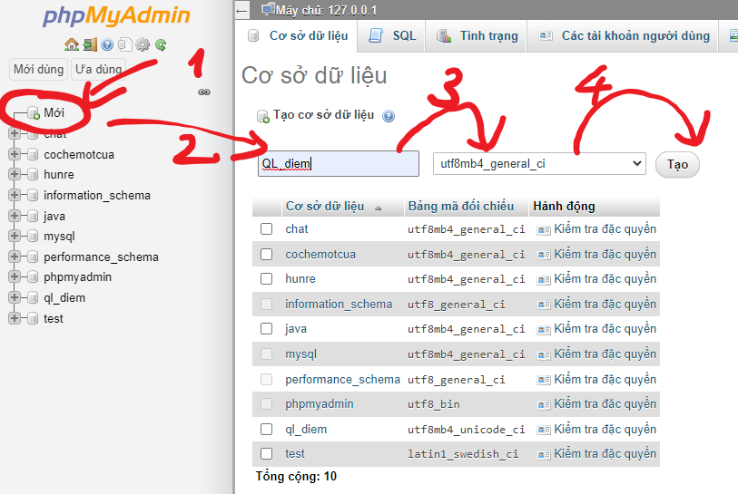
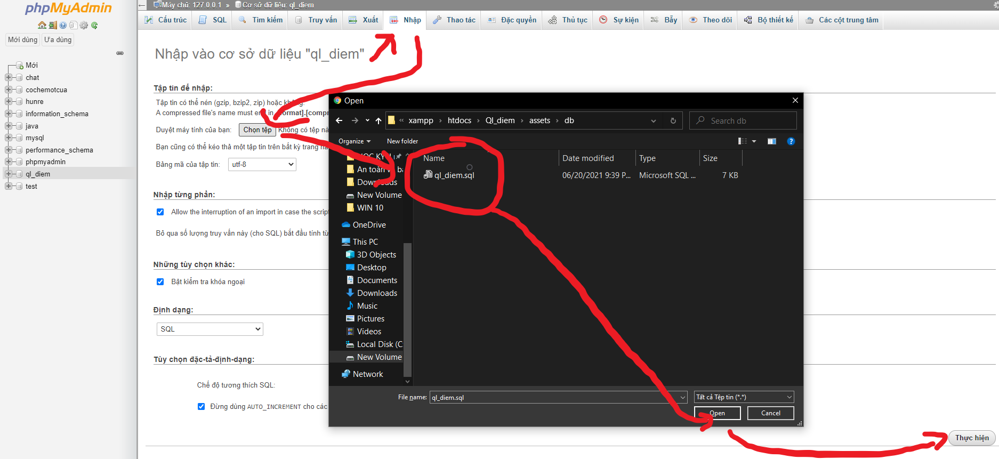

# Hướng dẫn cài phần mềm quản lý điểm


 1. ### Cài Xampp 
    - Truy cập vào trang: 
        ```
        https://www.apachefriends.org/download.html
        ```
    - Tải về và cài đặt file exe
 2. ### Cài project 
    - Đưa project đã giải nén hoặc clone từ git vào thư mực: 
        ```
            Đường dẫn cài đặt xampp\xampp\htdocs
        ```

 3. ### Cài Database
    3.1. Khởi động xampp **start** Apache, Mysql
    <br>
     

    3.2. Truy cập vào phpMyadmin và tạo 1 database mới **Ql_diem** :
    - Đường Dẫn phpMyadmin:
        ```
        http://localhost/phpmyadmin/
        ```
    - Tạo database:
    <br>
    

    3.3. Nhập database
        <br>
        
        <br>
    - Chọn database vừa tạo 
    - Chọn chức năng nhập
    - Chọn file database tại thư mực:
    ```
    xampp\htdocs\Ql_diem\assets\db
    ```
    - Chọn thực hiện
4. Chạy project
    <br>
    4.1. Chạy trang quản trị
    ```
    http://localhost/Ql_diem/PageQL.html
    ```
    - Tài Khoản: admin
    - Mật Khẩu: 123
    <br>
    
    4.2. Chạy trang sinh viên
    ```
    http://localhost/Ql_diem/PageSV.html
    ```
    

